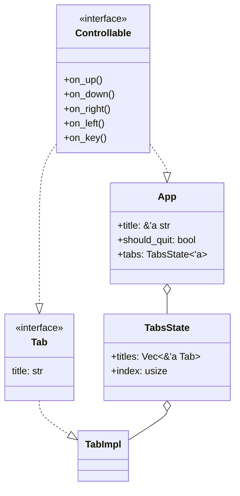
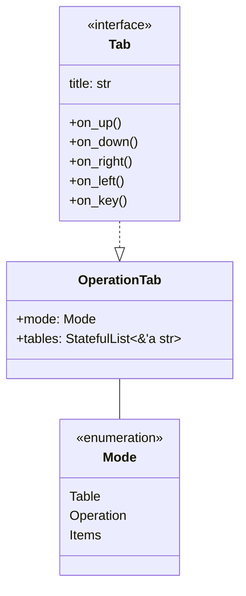

```mermaid
classDiagram
  class Controllable{
    <<interface>>
    +on_up()
    +on_down()
    +on_right()
    +on_left()
    +on_key()
  }

  class App{
    +title: &'a str
    +should_quit: bool
    +tabs: TabsState<'a>
  }

  class TabsState{
    +titles: Vec<&'a Tab>
    +index: usize
  }

  class Tab{
    <<interface>>
    title: str
  }

  class TabImpl{
  }

  Controllable ..|> App
  Controllable ..|> Tab
  Tab ..|> TabImpl
  App o-- TabsState
  TabsState o-- TabImpl
```

```mermaid
classDiagram

  class Tab{
    <<interface>>
    title: str
    +on_up()
    +on_down()
    +on_right()
    +on_left()
    +on_key()
  }

  class OperationTab{
    +mode: Mode
    +tables: StatefulList<&'a str>
  }

  Tab ..|> OperationTab
  OperationTab -- Mode

  class Mode{
    <<enumeration>>
    Table
    Operation
    Items
  }
```
